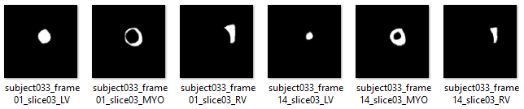

# Cardiac dataset transformer
Several medical datasets comprise data in DICOM format. Although this format includes a lot of valuable information (data + metadata in the header), it cannot be easily exploited with traditional image-based dataloaders (e.g. torchvision). Most of existing custom dataloaders load the DICOM data directly as tensors, even if we do not need all the information included in the "nii" file (e.g. all slices of an MRI), **overloading memory** and introducing **extra overhead** during training a DNN. In this repo, we propose dataset transformers that enable an image-based dataset generation from cardiac DICOM data. The generated datasets are ready-to-use with any generic image dataloader. The transformers are built for [PyTorch](https://pytorch.org/) and [PyTorch-Lightning](https://pytorch-lightning.readthedocs.io/en/latest/), however as the core processing is pure Python, they can be easily adapted for any DL framework. 


## Prerequisites
The architecture has been implemented using the following:
- Python 3.7.1
- PyTorch Lightning
- PyTorch 1.7


## Supported datasets
- **ACDC** - this dataset consists of cardiac images acquired from MRI scanners across 100 subjects, and provides pathology annotations (5 classes) for all images and pixel-level segmentation masks for end-systole and end-diastole per subject. ACDC was introduced as a challenge - [challenge URL](https://www.creatis.insa-lyon.fr/Challenge/acdc/databases.html)
- **M&Ms** - this dataset consists of cardiac-MR images acquired from 4 different (known) sites, across 345 subjects. It provides end-systole and end-diastole pixel-level segmentation masks annotations for 320 out of 345 subjects and pathology annotations for all images. In our M&Ms transformer we use the 4 most dominant pathology classes. M&Ms was introduced as a challenge - [challenge URL](https://www.ub.edu/mnms/)


## Transforming ACDC
We assume the following structure when downloading ACDC from the provider.
```
acdc_root
  |
  |-----patient001
  |	  |-----Info.cfg
  |	  |-----patient001_4d.nii
  |	  |-----patient001_frame01.nii
  |	  |-----patient001_frame01_gt.nii
  |	  |-----patient001_frame12.nii
  |	  |-----patient001_frame12_gt.nii  
  |
  |-----patientXXX
  |	  |-----Info.cfg
  |	  |-----patientXXX_4d.nii
  |	  |-----patientXXX_frameXX.nii
  |	  |-----patientXXX_frameXX_gt.nii
  |	  |-----patientXXX_frameXX.nii
  |	  |-----patientXXX_frameXX_gt.nii  
  |
```
More details about the data structure:
- Info.cfg - configuration file that contains metadata, such as the pathology/disease class.
- patientXXX_4d.nii - the **full sequence** of the MRI in NIFTI format.
- patientXXX_frameXX.nii - **end-systole** or **end-diastole** frame in NIFTI format.
- patientXXX_frameXX_gt.nii - **pixel-level annotation** of the end-systole or end-diastole frame in NIFTI format. The annotation covers **3 semantic classes**: left ventricular cavity (LV), myocardium (MYO) of the LV, and right ventricle (RV).

The structure of the generated dataset will be as follows:
```
processed_acdc_root
	|
  	|-----labeled_2
  	|	  |-----images
	|	  |	   |-----subject001_frame01_slice02.png
	|	  |	   |-----subject001_frame12_slice02.png
	|	  |	   |-----...
	|	  |
  	|	  |-----masks
	|	  |	   |-----subject001_frame01_slice02_LV.png
	|	  |	   |-----subject001_frame01_slice02_MYO.png
	|	  |	   |-----subject001_frame01_slice02_RV.png
	|	  |	   |-----subject001_frame12_slice02_LV.png
	|	  |	   |-----subject001_frame12_slice02_MYO.png
	|	  |	   |-----subject001_frame12_slice02_RV.png
	|	  |	   |-----...
	|	  |
  	|	  |-----labels
	|	  |	   |-----labels.json
  	|
  	|-----data-type_slice-number
  	|	  |-----images
	|	  |	   |-----subjectXXX_frameXX_sliceXX.png
	|	  |	   |-----...
	|	  |
  	|	  |-----masks
	|	  |	   |-----subjectXXX_frameXX_sliceXX_LV.png
	|	  |	   |-----subjectXXX_frameXX_sliceXX_MYO.png
	|	  |	   |-----subjectXXX_frameXX_sliceXX_RV.png
	|	  |	   |-----...
	|	  |
  	|	  |-----labels
	|	  |	   |-----labels.json
	|
```
More details about the generated data structure:
- data-type - referes to labeled or unlabeled data. By *labeled* we indicate the data that have segmentation masks annotation available. For the *unlabeled* data, the "masks" directory is not generated.
- slice-number - indicates the chosen MRI slice. If slice-number is "-1" then all available slices have been generated.
- images - the cardiac MRI in PNG format.
- masks - the LV, MYO, RV binary segmentation masks in PNG format.
- labels - a JSON file that contains the pathology/disease classes of the corresponding patient.

The ACDC dataset can be transformed using the following command:
```
python process_acdc.py --data_dir /path/to/ACDC --save_data_dir /path/to/processed/ACDC
```

To see all the available arguments (e.g. labeled | unlabeled, slice number, etc.) run the following command:
```
python process_acdc.py --help
```

## Transforming M&Ms
We assume the following structure when downloading M&Ms from the provider.
```
mnm_root
  |
  |-----Labeled
  |	  |-----VendorA
  |	  |	  |-----A0S9V9
  |	  |	  |	   |-----A0S9V9_sa.nii
  |	  |	  |	   |-----A0S9V9_sa_gt.nii
  |	  |	  |
  |	  |	  |-----PatientXX
  |	  |	  |	   |-----PatientXX_sa.nii
  |	  |	  |	   |-----PatientXX_sa_gt.nii
  |	  |	  |
  |	  |	  |-----...
  |	  |
  |	  |-----VendorX
  |	  |	  |-----PatientXX
  |	  |	  |	   |-----PatientXX_sa.nii
  |	  |	  |	   |-----PatientXX_sa_gt.nii
  |	  |	  |
  |	  |	  |-----...
  |	  |
  |
  |-----Unlabeled
  |	  |-----VendorC
  |	  |	  |-----A2E3W4
  |	  |	  |	   |-----A2E3W4_sa.nii
  |	  |	  |
  |	  |	  |-----PatientXX
  |	  |	  |	   |-----PatientXX_sa.nii
  |	  |	  |
  |	  |	  |-----...
  |	  |  
  |
  |-----mnms_pathologies_info.csv
  |
  |-----mnms_dataset_info.csv
  |
```
More details about the data structure:
- mnms_pathologies_info - xls/csv file that contains pathology/disease class per patient.
- mnms_dataset_info - xls/csv file that contains vendor, end-systole and end-diastole frame indices.
- patientXXX_sa.nii - the **full sequence** of the MRI in NIFTI format.
- patientXXX_sa_gt.nii - **pixel-level annotation** of the end-systole or end-diastole frame in NIFTI format. The annotation covers **3 semantic classes**: left ventricular cavity (LV), myocardium (MYO) of the LV, and right ventricle (RV).

The structure of the generated dataset will be as follows:
```
processed_mnm_root
	|
  	|-----labeled_vendorA_2
  	|	  |-----images
	|	  |	   |-----subjectA0S9V9-vendorA_frame00_slice02.png
	|	  |	   |-----subjectA0S9V9-vendorA_frame09_slice02.png
	|	  |	   |-----...
	|	  |
  	|	  |-----masks
	|	  |	   |-----subjectA0S9V9-vendorA_frame00_slice02_LV.png
	|	  |	   |-----subjectA0S9V9-vendorA_frame00_slice02_MYO.png
	|	  |	   |-----subjectA0S9V9-vendorA_frame00_slice02_RV.png
	|	  |	   |-----subjectA0S9V9-vendorA_frame09_slice02_LV.png
	|	  |	   |-----subjectA0S9V9-vendorA_frame09_slice02_MYO.png
	|	  |	   |-----subjectA0S9V9-vendorA_frame09_slice02_RV.png
	|	  |	   |-----...
	|	  |
  	|	  |-----labels
	|	  |	   |-----labels.json
  	|
  	|-----data-type_vendor_slice-number
  	|	  |-----images
	|	  |	   |-----subjectXXX-vendorX_frameXX_sliceXX.png
	|	  |	   |-----...
	|	  |
  	|	  |-----masks
	|	  |	   |-----subjectXXX-vendorX_frameXX_sliceXX_LV.png
	|	  |	   |-----subjectXXX-vendorX_frameXX_sliceXX_MYO.png
	|	  |	   |-----subjectXXX-vendorX_frameXX_sliceXX_RV.png
	|	  |	   |-----...
	|	  |
  	|	  |-----labels
	|	  |	   |-----labels.json
	|
```
More details about the generated data structure:
- data-type - referes to labeled or unlabeled data. By *labeled* we indicate the data that have segmentation masks annotation available. For the *unlabeled* data, the "masks" directory is not generated.
- slice-number - indicates the chosen MRI slice. If slice-number is "-1" then all available slices have been generated.
- images - the cardiac MRI in PNG format.
- masks - the LV, MYO, RV binary segmentation masks in PNG format.
- labels - a JSON file that contains the pathology/disease classes of the corresponding patient.

The ACDC dataset can be transformed using the following command:
```
python process_mnm.py --data_dir /path/to/MnM --save_data_dir /path/to/processed/MnM
```

To see all the available arguments (e.g. labeled | unlabeled, slice number, etc.) run the following command:
```
python process_mnm.py --help
```

## Examples




## License
The code is released under the MIT License.
